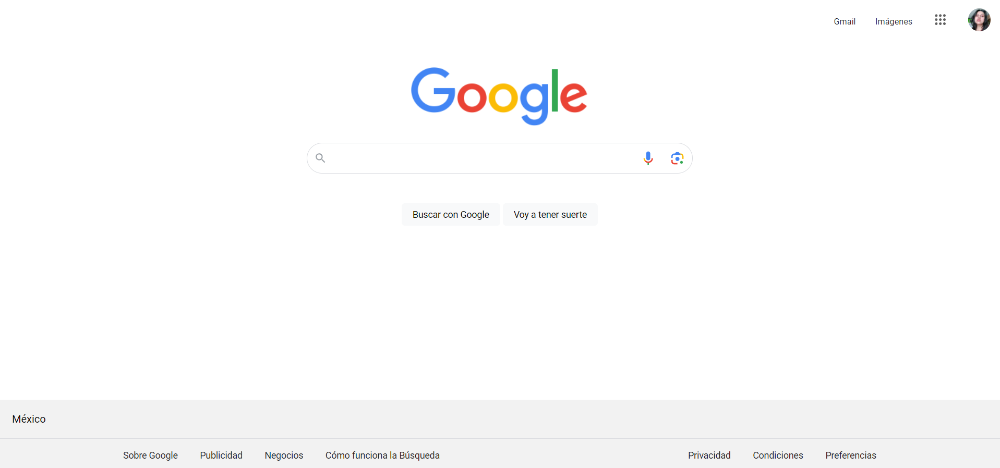

# Proyecto Clon de google

Este proyecto es una réplica de la página principal de Google, creada como parte del bootcamp de desarrollo frontend de Technolochicas PRO. 

El desarrollo se realizó utilizando exclusivamente HTML y CSS puro, con el objetivo de practicar y fortalecer el dominio de estas tecnologías.

Cabe destacar que la página es estática y no incluye funcionalidad interactiva.

[Proyecto Desplegado (https://clon-google-plum.vercel.app/)](https://clon-google-plum.vercel.app/)

## Tecnologia
* HTML
* CSS

## Vista previa de la pagina

---
Desarrollado con 🤍 por [Karina Escalante](https://www.instagram.com/kary_olmos_22?igsh=aHI4c2hubzB3NXEx) en [TECHNOLOCHICAS PRO](https://tecnolochicas.mx/)